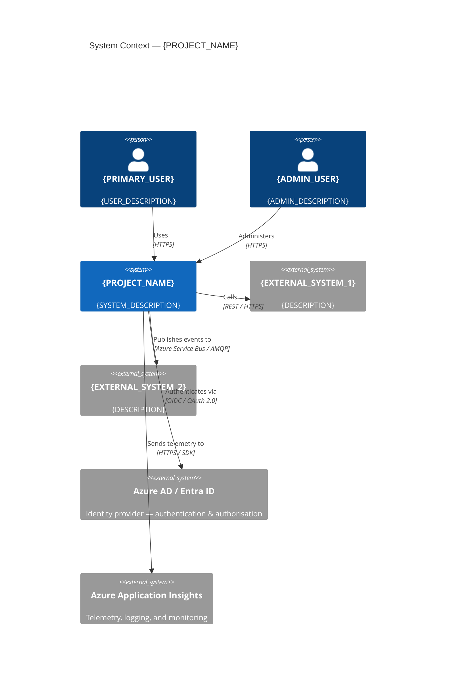
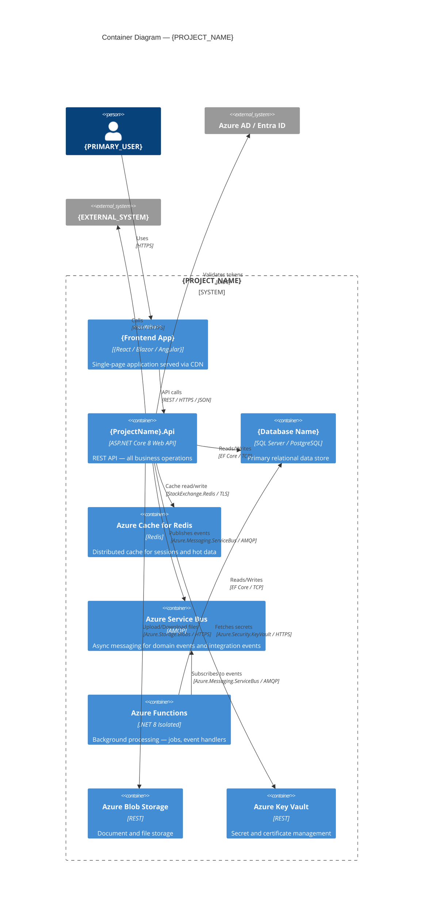
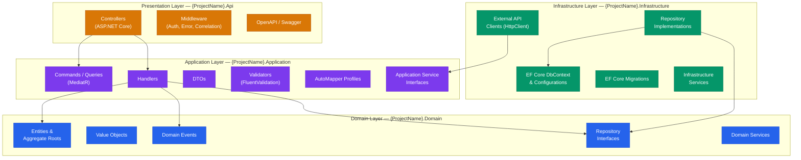
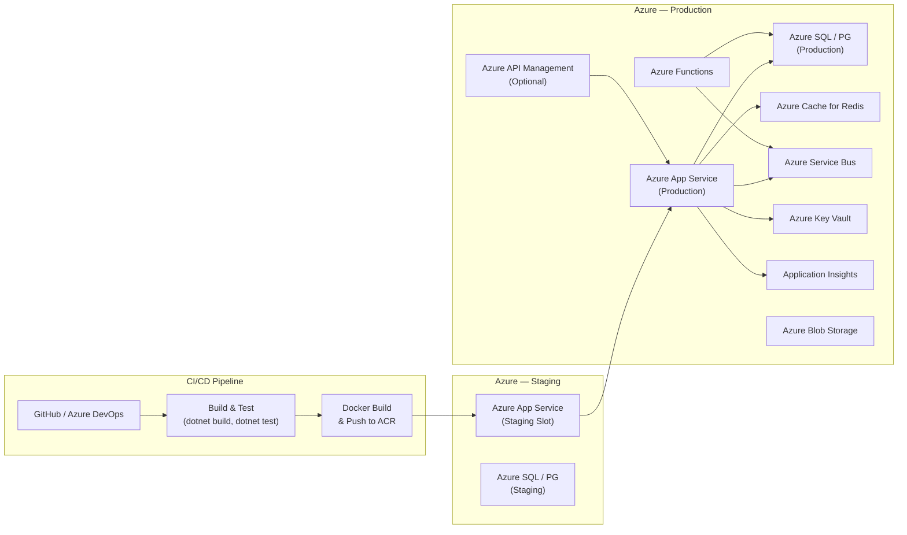

# Architecture Document

---

## Document Metadata

| Field              | Value                             |
|--------------------|-----------------------------------|
| Project Name       | `{PROJECT_NAME}`                  |
| Version            | `{VERSION}`                       |
| Date               | `{DATE}`                          |
| Architect          | `{ARCHITECT_NAME}`                |
| Tech Lead          | `{TECH_LEAD_NAME}`                |
| Status             | `{DRAFT / UNDER_REVIEW / APPROVED}` |
| PRD Reference      | `{PRD_VERSION}`                   |
| Breakdown Ref      | `{BREAKDOWN_VERSION}`             |

---

## Architecture Overview

> _Describe the overall architectural approach, key decisions, and guiding principles. Reference any significant ADRs._

{ARCHITECTURE_OVERVIEW_TEXT}

### Guiding Principles

1. **Clean Architecture** — Dependency rule enforced: outer layers depend on inner layers, never the reverse.
2. **Domain-Driven Design** — Business logic lives in the Domain layer; application orchestrates use cases.
3. **CQRS** — Commands (writes) and Queries (reads) separated using MediatR.
4. **API-First** — OpenAPI specification is the contract; generated documentation is always up to date.
5. **Security by Default** — Auth enforced at API gateway/controller level; sensitive data in Azure Key Vault.
6. **Observability** — Structured logging, distributed tracing, and metrics via Application Insights.
7. **Twelve-Factor App** — Config via environment / Key Vault, stateless processes, explicit dependencies.

---

## C4 Level 1: System Context Diagram



---

## C4 Level 2: Container Diagram



---

## Technology Stack

| Layer / Concern          | Technology / Package                                         | Version      | Justification                             |
|--------------------------|--------------------------------------------------------------|--------------|-------------------------------------------|
| **Runtime**              | .NET 8 (LTS)                                                 | 8.x          | LTS support until Nov 2026                |
| **Web Framework**        | ASP.NET Core 8                                               | 8.x          | First-class .NET web API framework        |
| **ORM**                  | Entity Framework Core                                        | 8.x          | Mature, well-integrated .NET ORM          |
| **Database**             | {SQL Server / PostgreSQL / Azure SQL}                        | {VER}        | {JUSTIFICATION}                           |
| **CQRS Mediator**        | MediatR                                                      | 12.x         | Clean CQRS implementation                 |
| **Validation**           | FluentValidation                                             | 11.x         | Expressive, testable validation rules     |
| **Object Mapping**       | AutoMapper                                                   | 12.x         | Reduces boilerplate mapping code          |
| **Logging**              | Serilog + Microsoft.Extensions.Logging                       | 8.x          | Structured logging with multiple sinks    |
| **API Documentation**    | Swashbuckle (OpenAPI 3)                                      | 6.x          | Auto-generated, always up-to-date docs    |
| **Authentication**       | Microsoft.Identity.Web                                       | 2.x          | Azure AD / Entra ID integration           |
| **Caching**              | Microsoft.Extensions.Caching + StackExchange.Redis           | 8.x / 2.x   | Distributed cache                         |
| **Messaging**            | Azure.Messaging.ServiceBus                                   | 7.x          | Reliable async messaging                  |
| **Testing**              | xUnit + Moq + FluentAssertions + WebApplicationFactory       | Latest       | Industry standard .NET testing stack      |
| **Code Analysis**        | StyleCop.Analyzers + Roslynator                              | Latest       | Enforce coding standards                  |
| **Container**            | Docker + Azure Container Registry                            | Latest       | Reproducible builds                       |
| **CI/CD**                | {GitHub Actions / Azure DevOps}                              | Latest       | {JUSTIFICATION}                           |
| **Monitoring**           | Azure Application Insights                                   | Latest SDK   | Distributed tracing, metrics, alerts      |
| **Secret Management**    | Azure Key Vault + Azure.Extensions.AspNetCore.Configuration  | Latest       | Secure secret injection                   |

---

## Clean Architecture Layer Diagram



### Project Structure

```
{ProjectName}.sln
├── src/
│   ├── {ProjectName}.Domain/           # Entities, VOs, domain events, repo interfaces
│   ├── {ProjectName}.Application/      # Use cases, CQRS, DTOs, validators
│   ├── {ProjectName}.Infrastructure/   # EF Core, repositories, external clients
│   └── {ProjectName}.Api/              # ASP.NET Core controllers, middleware, startup
├── tests/
│   ├── {ProjectName}.Domain.Tests/
│   ├── {ProjectName}.Application.Tests/
│   ├── {ProjectName}.Infrastructure.Tests/
│   └── {ProjectName}.Api.Tests/        # Integration tests with WebApplicationFactory
└── docker/
    └── Dockerfile
```

---

## Domain Model

### Core Aggregates

```mermaid
classDiagram
  class {AggregateRoot1} {
    +Guid Id
    +{Property1} {Prop}
    +{Property2} {Prop}
    +DateTime CreatedAt
    +DateTime? UpdatedAt
    +List~{ChildEntity}~ Items
    +{Method}() void
  }

  class {ChildEntity} {
    +Guid Id
    +{Property} {Prop}
  }

  class {ValueObject1} {
    +{Property} {Prop}
    +IsValid() bool
  }

  {AggregateRoot1} "1" *-- "many" {ChildEntity}
  {AggregateRoot1} *-- {ValueObject1}
```

---

## Data Architecture

### Database: {DATABASE_NAME}

| Concern                    | Approach                                                             |
|----------------------------|----------------------------------------------------------------------|
| ORM                        | Entity Framework Core 8 with Fluent API configuration                |
| Migrations                 | Code-first migrations, applied on startup in non-prod / via CI in prod |
| Connection Management      | Connection string in Azure Key Vault; injected via `IConfiguration`  |
| Concurrency                | Optimistic concurrency via `RowVersion` / `xmin` token               |
| Soft Delete                | `ISoftDeletable` with global query filter in `DbContext`             |
| Audit Trail                | `AuditableEntity` base class with `CreatedAt/By`, `UpdatedAt/By`    |
| Indexing Strategy          | Indexes on foreign keys, frequently-queried columns                  |
| Read Performance           | Projection queries with `.Select()`, `AsNoTracking()` for reads      |
| Connection Resiliency      | EF Core retry policy via `EnableRetryOnFailure()`                    |

### Entity Configurations (sample)

```csharp
// {ProjectName}.Infrastructure/Persistence/Configurations/{Entity}Configuration.cs
public class {Entity}Configuration : IEntityTypeConfiguration<{Entity}>
{
    public void Configure(EntityTypeBuilder<{Entity}> builder)
    {
        builder.HasKey(e => e.Id);
        builder.Property(e => e.{Property})
               .IsRequired()
               .HasMaxLength({N});
        builder.HasIndex(e => e.{IndexedProperty})
               .IsUnique();
        // Soft delete global filter configured in DbContext
    }
}
```

---

## API Design

### Conventions

| Convention                     | Rule                                                             |
|--------------------------------|------------------------------------------------------------------|
| Versioning                     | URL-based: `/api/v1/`, `/api/v2/`                               |
| Resource naming                | Plural nouns: `/api/v1/orders`, `/api/v1/customers`             |
| HTTP status codes              | 200 OK, 201 Created, 204 No Content, 400 Bad Request, 401, 403, 404, 409, 422, 500 |
| Pagination                     | `PageNumber` + `PageSize` query params; response includes `TotalCount`, `TotalPages` |
| Filtering / sorting            | Query string: `?status=active&sortBy=createdAt&sortDir=desc`    |
| Error responses                | RFC 7807 Problem Details (`ProblemDetails`)                     |
| Correlation                    | `X-Correlation-Id` header propagated through all requests       |
| Content type                   | `application/json` only                                         |

### Global Error Handling

```csharp
// Program.cs
app.UseExceptionHandler(appBuilder =>
{
    appBuilder.Run(async context =>
    {
        // Map domain exceptions to ProblemDetails responses
        // ValidationException → 422, NotFoundException → 404, etc.
    });
});
```

---

## Security Architecture

### Authentication & Authorisation

```
Client ──HTTPS──► API Gateway / APIM ──► ASP.NET Core API
                                              │
                                    JWT Bearer Token Validation
                                    (Microsoft.Identity.Web)
                                              │
                                    [Authorize] attribute / policies
                                              │
                                    Role / Claim checks
```

| Concern               | Implementation                                                        |
|-----------------------|-----------------------------------------------------------------------|
| Authentication        | Azure AD / Entra ID via OIDC; JWT bearer tokens validated per request |
| Authorisation         | ASP.NET Core policy-based auth; roles mapped from AAD app roles      |
| Secret management     | Azure Key Vault; never hardcoded or in `appsettings.json`            |
| TLS                   | HTTPS enforced via `UseHttpsRedirection()` and HSTS header            |
| CORS                  | Explicit allow list — no wildcard origins in production               |
| Rate limiting         | ASP.NET Core rate limiting middleware or Azure APIM policy            |
| SQL injection         | EF Core parameterised queries; no raw SQL without `FromSqlRaw` params |
| XSS / CSRF            | SPA-specific: Content-Security-Policy header, SameSite cookies       |
| Dependency scanning   | `dotnet list package --vulnerable` in CI pipeline                    |

---

## Performance Considerations

| Area                          | Strategy                                                              |
|-------------------------------|-----------------------------------------------------------------------|
| Database query optimisation   | `AsNoTracking()` for reads, projections with `.Select()`, EXPLAIN plans |
| Caching                       | Redis distributed cache for frequently read, rarely changed data      |
| Response compression          | `UseResponseCompression()` with Brotli + Gzip                        |
| Async/await everywhere        | No blocking `.Result` or `.Wait()` calls                             |
| HTTP client resilience        | Polly retry + circuit breaker via `IHttpClientFactory`               |
| Connection pooling            | EF Core connection pool defaults; adjust `MaxPoolSize` if needed     |
| Background processing         | Offload long-running tasks to Azure Functions / Hangfire              |
| Output caching                | `[OutputCache]` on appropriate read endpoints                        |
| Load testing                  | k6 / Azure Load Testing before go-live                               |

---

## Deployment Architecture



### Environment Configuration

| Environment | App Service Plan | Database SKU | Redis SKU     | Notes               |
|-------------|------------------|--------------|---------------|---------------------|
| Development | Local / Docker   | LocalDB / Docker | In-memory | Developer workstations |
| Staging     | B2 / P1V3        | S1 DTU       | C1 Basic      | Pre-prod validation |
| Production  | P2V3             | S3 DTU / GP  | C2 Standard   | HA + auto-scale     |

---

## ADR References

| ADR ID    | Title                                        | Status     | Date       |
|-----------|----------------------------------------------|------------|------------|
| ADR-0001  | {DECISION_TITLE}                             | Accepted   | {DATE}     |
| ADR-0002  | {DECISION_TITLE}                             | Accepted   | {DATE}     |
| ADR-0003  | {DECISION_TITLE}                             | Proposed   | {DATE}     |
| ADR-0004  | Use CQRS with MediatR for all use cases      | Accepted   | {DATE}     |
| ADR-0005  | Use EF Core with Code-First migrations       | Accepted   | {DATE}     |

> Full ADR details in `.bmad/adrs/` directory. Use `adr_template.md` for new decisions.

---

## Non-Functional Requirements Validation

| NFR ID  | Requirement                          | Architecture Component Addressing It             | Verified By               |
|---------|--------------------------------------|--------------------------------------------------|---------------------------|
| NFR-P1  | API p95 < 200ms                       | Redis caching, EF Core optimisation, scaling     | k6 load test              |
| NFR-S1  | JWT bearer auth on all endpoints      | `Microsoft.Identity.Web` + `[Authorize]`        | API integration tests     |
| NFR-S2  | Secrets in Key Vault                  | `Azure.Extensions.AspNetCore.Configuration.Secrets` | Infrastructure review   |
| NFR-A4  | Health check endpoints                | `app.MapHealthChecks("/health")`                 | Smoke tests               |
| NFR-N1  | .NET 8 LTS                           | All project TFMs set to `net8.0`                 | `dotnet build` output     |
| NFR-N4  | Nullable reference types enabled      | `<Nullable>enable</Nullable>` in all .csproj     | `dotnet build` — 0 warnings |

---

## Plan Approved Gate Checklist

> _All items must be checked before implementation (Sprint 1) begins._

- [ ] Architecture document reviewed and approved by Tech Lead
- [ ] All major ADRs documented and accepted
- [ ] Clean Architecture layer diagram matches agreed solution structure
- [ ] Technology stack approved (no unapproved dependencies)
- [ ] Security architecture reviewed by Security team
- [ ] Azure resource provisioning plan confirmed with Cloud/Platform team
- [ ] Database schema and EF Core migration strategy agreed
- [ ] CI/CD pipeline design approved
- [ ] Monitoring and alerting strategy defined
- [ ] NFRs validated — each has a clear architectural mechanism addressing it
- [ ] Integration points documented and owners notified
- [ ] Developer environment setup guide produced
- [ ] All ADR references linked from this document
- [ ] **PLAN_APPROVED gate: APPROVED ✅ / BLOCKED ❌**

**Approved by:** {NAME} | **Date:** {DATE} | **Signature:** {SIGNATURE}
