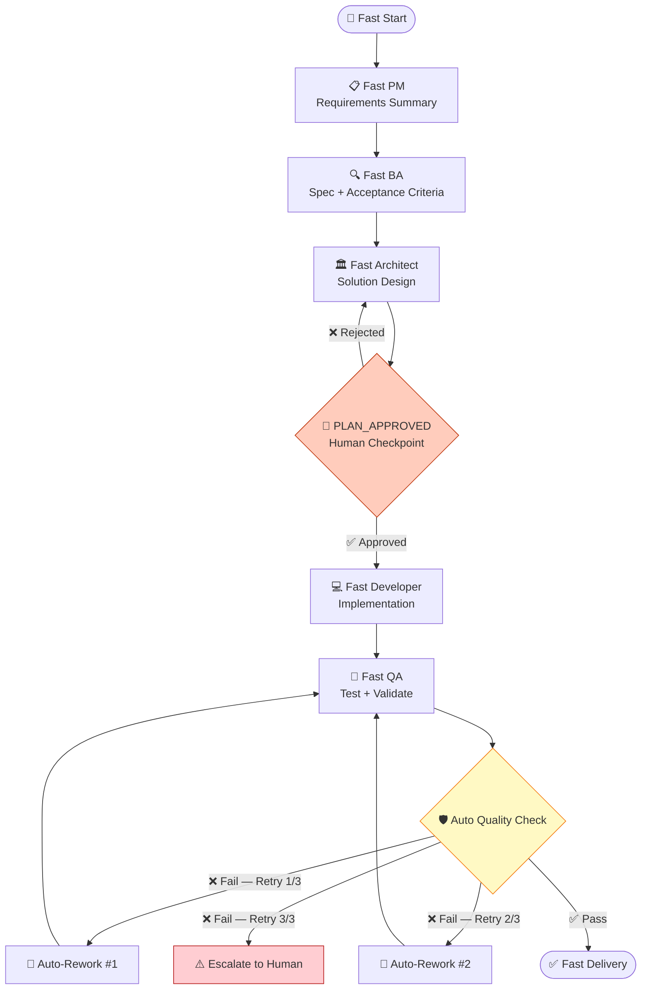

# 🤖 BMAD Framework

[](LICENSE)
[](https://dotnet.microsoft.com/)
[](https://azure.microsoft.com/)
[](https://code.visualstudio.com/)

**Breakthrough Method of Agile AI-Driven Development**

A pure Markdown + YAML framework that turns **VS Code GitHub Copilot (Claude) in Agent Mode** into a virtual AI development team. No runtime dependencies. No API keys. Just Markdown instructions for LLMs.

> Designed specifically for **C# / .NET consultants** who need structured, repeatable AI-assisted delivery across client engagements.

---

## 📋 Table of Contents

- [What is BMAD?](#what-is-bmad)
- [Quick Start](#quick-start)
- [Enterprise Workflow](#enterprise-workflow)
- [Fast Kit Workflow](#fast-kit-workflow)
- [Agent Team](#agent-team)
- [How to Use](#how-to-use)
- [Enterprise Quality Gates](#enterprise-quality-gates)
- [Configuration Guide](#configuration-guide)
- [Portable Setup](#portable-setup)
- [.NET / C# Focus](#net--c-focus)
- [File Structure](#file-structure)

---

## What is BMAD?

BMAD is a **zero-dependency AI orchestration framework** built entirely in Markdown and YAML. It defines a team of specialized AI agents — each with a distinct persona, responsibilities, and handoff protocol — that guide a software project from initial idea through production-ready code.

**Key principles:**
- 📄 **Pure text** — every agent is a `.md` file with role instructions and constraints
- 🔗 **Structured handoffs** — each agent produces a defined output that feeds the next
- 🏗️ **Two modes** — Enterprise (full SDLC with quality gates) and Fast Kit (rapid delivery with auto-rework)
- 🧑‍💼 **Consultant-ready** — portable, client-agnostic, no server or service required

---

## Quick Start

```bash
# Clone the framework next to your client project
git clone https://github.com/Bl4zer97/bmad-framework-noagent.git

# Open in VS Code
code bmad-framework-noagent

# Invoke the orchestrator in Copilot Agent Mode
# @bmad-orchestrator start enterprise workflow for [your project]
```

In VS Code Copilot Chat (Agent Mode):
```
@bmad-orchestrator start enterprise workflow for a REST API that manages client invoices in .NET 8
```

---

## Enterprise Workflow

The Enterprise workflow covers the full SDLC with explicit quality gates requiring human approval at critical checkpoints.

```mermaid
flowchart TD
    Start([🚀 Project Start]) --> A

    subgraph PhaseA ["Phase A — Requirements"]
        A[📋 PM Agent\nJohn] -->|Product Requirements Doc| A_out[PRD.md]
    end

    A_out --> B

    subgraph PhaseB ["Phase B — Business Analysis"]
        B[🔍 BA Agent\nSophia] -->|BA Review Document| B_out[BA-REVIEW.md]
        B_out --> AI_GATE{🤖 AI_READY Gate\nScore ≥ 90?}
        AI_GATE -->|❌ Score < 90| B_rework[🔄 BA Rework]
        B_rework --> B
        AI_GATE -->|✅ Score ≥ 90| C
    end

    subgraph PhaseC ["Phase C — Spec Breakdown"]
        C[🔍 BA Agent\nSophia] -->|Functional Specs| C_out[SPECS.md]
    end

    C_out --> D

    subgraph PhaseD ["Phase D — Architecture"]
        D[🏛️ Architect Agent\nWinston] -->|Architecture Document| D_out[ARCHITECTURE.md]
        D_out --> PLAN_GATE{👤 PLAN_APPROVED\nHuman Review}
        PLAN_GATE -->|❌ Rejected| D_rework[🔄 Architect Rework]
        D_rework --> D
        PLAN_GATE -->|✅ Approved| E
    end

    subgraph PhaseE ["Phase E — Planning"]
        E[📋 PM Agent\nJohn] -->|Epics + Stories| E_out[SPRINT-PLAN.md]
        E_out --> ATDD_GATE{✅ ATDD Gate\nAcceptance Tests Defined?}
        ATDD_GATE -->|❌ Missing| E_rework[🔄 PM Rework]
        E_rework --> E
        ATDD_GATE -->|✅ All Defined| F
    end

    subgraph PhaseF ["Phase F — Implementation"]
        F[💻 Developer Agent\nAmelia] -->|C# / .NET Code| F_out[Source Code]
    end

    F_out --> G

    subgraph PhaseG ["Phase G — Quality Assurance"]
        G[🧪 QA Agent\nQuinn] -->|Test Suite| G_out[Tests + Reports]
        G_out --> QUALITY_GATE{🛡️ QUALITY Gate\nCoverage ≥ 70%\nAll Tests Pass?}
        QUALITY_GATE -->|❌ Failing| G_rework[🔄 Dev + QA Rework]
        G_rework --> F
        QUALITY_GATE -->|✅ Passing| Review
    end

    subgraph Review ["Review — Documentation"]
        Review_Agent[📝 Tech Writer\nAgent] -->|Technical Docs| Docs[DOCUMENTATION.md]
    end

    Docs --> Done([✅ Delivery Ready])

    style PhaseA fill:#e3f2fd,stroke:#1565c0
    style PhaseB fill:#f3e5f5,stroke:#6a1b9a
    style PhaseC fill:#f3e5f5,stroke:#6a1b9a
    style PhaseD fill:#e8f5e9,stroke:#2e7d32
    style PhaseE fill:#fff3e0,stroke:#e65100
    style PhaseF fill:#fce4ec,stroke:#880e4f
    style PhaseG fill:#e0f2f1,stroke:#00695c
    style Review fill:#f9fbe7,stroke:#558b2f
    style AI_GATE fill:#fff9c4,stroke:#f57f17
    style PLAN_GATE fill:#ffccbc,stroke:#bf360c
    style ATDD_GATE fill:#fff9c4,stroke:#f57f17
    style QUALITY_GATE fill:#fff9c4,stroke:#f57f17
```



---

## Fast Kit Workflow

The Fast Kit is designed for rapid prototyping and single-sprint delivery. One human checkpoint (`PLAN_APPROVED`), automatic rework loops (max 3 retries), and direct agent-to-agent handoffs.



---

## Agent Team

### Enterprise Agents (`agents/enterprise/`)

| Agent | @Mention | Persona | Phases | Responsibilities |
|-------|----------|---------|--------|-----------------|
| Orchestrator | `@bmad-orchestrator` | BMAD Master | All | Coordinates workflow, routes tasks, manages gates |
| PM | `@bmad-pm` | John | A, E | PRD creation, epic/story planning, sprint plans |
| BA | `@bmad-ba` | Sophia | B, C | Business analysis, AI_READY scoring, spec breakdown |
| Architect | `@bmad-architect` | Winston | D | Solution architecture, ADRs, technology decisions |
| Developer | `@bmad-developer` | Amelia | F | C# / .NET implementation, Clean Architecture |
| QA | `@bmad-qa` | Quinn | G | Test strategy, xUnit tests, coverage enforcement |
| Tech Writer | `@bmad-techwriter` | — | Review | API docs, README, architecture docs |

### Fast Kit Agents (`agents/fast/`)

| Agent | @Mention | Persona | Role |
|-------|----------|---------|------|
| Fast Orchestrator | `@bmad-fast-orchestrator` | BMAD Fast | Auto-routes fast workflow |
| Fast PM | `@bmad-fast-pm` | Fast John | Condensed requirements |
| Fast BA | `@bmad-fast-ba` | Fast Sophia | Quick spec + acceptance criteria |
| Fast Architect | `@bmad-fast-architect` | Fast Winston | Lean architecture design |
| Fast Developer | `@bmad-fast-developer` | Fast Amelia | Rapid implementation |
| Fast QA | `@bmad-fast-qa` | Fast Quinn | Automated test validation |

---

## How to Use

### VS Code GitHub Copilot Agent Mode

1. Open VS Code with the **GitHub Copilot** extension installed
2. Open Copilot Chat: `Ctrl+Shift+I` (Windows/Linux) or `Cmd+Shift+I` (macOS)
3. Select **"Agent"** mode from the dropdown
4. Reference an agent file and type your request:

```
@bmad-orchestrator start enterprise workflow for a .NET 8 REST API to manage client invoices
```

```
@bmad-architect design a clean architecture solution for a multi-tenant SaaS platform
```

```
@bmad-developer implement the InvoiceService class following the architecture in ARCHITECTURE.md
```

> **Tip:** The Orchestrator reads the workflow state from `.bmad/` and automatically hands off to the next agent.

### /prompt Mode (Copilot Chat)

Use `/bmad-*` style prompts to invoke specific roles without full agent mode:

```
/bmad-pm create a product requirements document for an inventory management API
/bmad-ba review the requirements and score them for completeness
/bmad-architect propose a Clean Architecture solution for this spec
```

### Claude Code

In Claude Code, use `/bmad-*` slash commands to load agent context:

```
/bmad-orchestrator
/bmad-developer implement the service layer
/bmad-qa generate xUnit tests for InvoiceService
```

The agent Markdown files are auto-loaded as slash command context.

---

## Enterprise Quality Gates

| Gate | Trigger | Criteria | Action on Failure |
|------|---------|----------|-------------------|
| **AI_READY** | End of Phase B (BA Review) | BA scores requirements ≥ 90/100 across completeness, clarity, testability, feasibility | BA reworks the requirements; loop until score ≥ 90 |
| **PLAN_APPROVED** | End of Phase D (Architecture) | Human engineer reviews and approves the architecture document | Architect revises based on feedback |
| **ATDD** | End of Phase E (Sprint Planning) | Every user story has defined acceptance tests before development begins | PM reworks stories to add missing acceptance criteria |
| **QUALITY** | End of Phase G (QA) | Code coverage ≥ 70%, all xUnit tests passing, no critical static analysis issues | Developer + QA rework until gate passes |

---

## Configuration Guide

The framework reads optional configuration from `bmad.settings.yml` at the workspace root:

```yaml
# bmad.settings.yml
workflow:
  mode: enterprise          # enterprise | fast
  quality_gate_coverage: 70 # minimum % for QUALITY gate
  ai_ready_threshold: 90    # minimum score for AI_READY gate
  max_fast_retries: 3       # max auto-rework loops in Fast Kit

project:
  name: "My Client Project"
  dotnet_version: "net8.0"
  architecture: clean       # clean | hexagonal | layered
  test_framework: xunit     # xunit | nunit | mstest

output:
  bmad_dir: .bmad           # where workflow artifacts are stored
  commit_artifacts: false   # whether to commit .bmad/*.md to git
```

Key settings:
- **`workflow.mode`** — switch between `enterprise` and `fast` workflows
- **`quality_gate_coverage`** — adjust the minimum test coverage threshold
- **`project.architecture`** — tells agents which architectural pattern to follow
- **`output.bmad_dir`** — change where workflow Markdown files are written

---

## Portable Setup

BMAD is designed to work **alongside** any client project without touching the client's repository.

See **[PORTABLE-SETUP.md](PORTABLE-SETUP.md)** for:
- Sibling directory setup
- Subdirectory with `.gitignore` setup
- VS Code `.code-workspace` configuration
- Consultant use cases and tips

---

## .NET / C# Focus

All agents are optimized for the Microsoft ecosystem:

| Technology | Usage |
|-----------|-------|
| **.NET 8+** | Target framework for all generated code |
| **Clean Architecture** | Default project structure (Domain → Application → Infrastructure → API) |
| **DDD / CQRS** | Domain modeling with MediatR for command/query separation |
| **xUnit** | Test framework; Moq for mocking; FluentAssertions for readability |
| **Azure** | Deployment target; agents understand Azure services (App Service, Functions, Service Bus) |
| **Entity Framework Core** | Data access layer with Code First migrations |
| **ASP.NET Core** | Web API and minimal API patterns |

Agents produce code that follows:
- Microsoft's [.NET Application Architecture Guides](https://dotnet.microsoft.com/en-us/learn/dotnet/architecture-guides)
- SOLID principles with constructor injection
- Nullable reference types enabled
- `async`/`await` throughout

---

## File Structure

```
bmad-framework-noagent/
│
├── README.md                    ← This file
├── PORTABLE-SETUP.md            ← Consultant portable setup guide
├── bmad.settings.yml            ← Optional framework configuration
│
├── agents/
│   ├── enterprise/              ← Full SDLC agents
│   │   ├── orchestrator.md      ← Master coordinator
│   │   ├── pm.md                ← John — Product Manager
│   │   ├── ba.md                ← Sophia — Business Analyst
│   │   ├── architect.md         ← Winston — Solution Architect
│   │   ├── developer.md         ← Amelia — .NET Developer
│   │   ├── qa.md                ← Quinn — QA Engineer
│   │   └── techwriter.md        ← Technical Writer
│   │
│   └── fast/                    ← Fast Kit agents
│       ├── orchestrator.md      ← Fast coordinator (auto-rework)
│       ├── pm.md                ← Fast PM
│       ├── ba.md                ← Fast BA
│       ├── architect.md         ← Fast Architect
│       ├── developer.md         ← Fast Developer
│       └── qa.md                ← Fast QA
│
├── .bmad/                       ← Workflow artifacts (generated)
│   ├── PRD.md                   ← Product Requirements Doc (Phase A)
│   ├── BA-REVIEW.md             ← BA Review + AI_READY score (Phase B)
│   ├── SPECS.md                 ← Functional specifications (Phase C)
│   ├── ARCHITECTURE.md          ← Architecture document (Phase D)
│   ├── SPRINT-PLAN.md           ← Epics, stories, sprint plan (Phase E)
│   └── DOCUMENTATION.md         ← Final technical docs (Review)
│
└── .github/
    └── workflows/               ← CI/CD pipeline definitions
```

> **Note:** The `.bmad/` directory contains generated workflow artifacts. These are working documents for the current engagement and should generally not be committed to the client's repository. See [PORTABLE-SETUP.md](PORTABLE-SETUP.md) for details.

---

## License

MIT — see [LICENSE](LICENSE)

---

*BMAD Framework — Bringing structure and repeatability to AI-assisted .NET development.*
