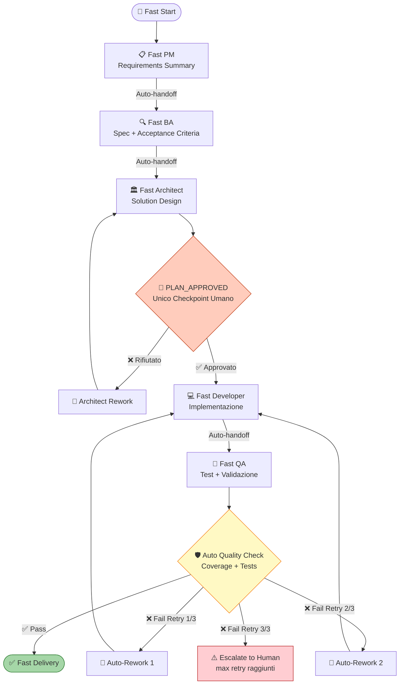

# 🤖 BMAD Framework

[](https://www.markdownguide.org/)
[](https://yaml.org/)
[](LICENSE)
[](https://code.visualstudio.com/)
[](https://www.anthropic.com/)

> **Breakthrough Method of Agile AI-Driven Development**

Framework **zero-dependency**, **pure Markdown+YAML** che trasforma **VS Code GitHub Copilot (Claude) in Agent Mode** in un team di sviluppo AI virtuale. Nessuna dipendenza runtime. Nessuna API key. Solo istruzioni Markdown per LLM.

> 🎯 Progettato specificamente per **consulenti C#/.NET** che necessitano di un metodo strutturato e ripetibile per la delivery AI-assisted su qualsiasi progetto cliente.

---

## 📋 Indice

- [Cos'è BMAD?](#cosè-bmad)
- [Diagramma Architetturale](#diagramma-architetturale)
- [Quick Start](#quick-start)
- [Enterprise Workflow](#enterprise-workflow)
- [Fast Kit Workflow](#fast-kit-workflow)
- [Tabella Agenti Completa](#tabella-agenti-completa)
- [Struttura del Progetto](#struttura-del-progetto)
- [Quality Gates](#quality-gates)
- [Model Routing (Fast Kit)](#model-routing-fast-kit)
- [Come Usare Ogni Agente](#come-usare-ogni-agente)
- [Casi d'Uso per Consulenti](#casi-duso-per-consulenti)
- [Setup Portatile](#setup-portatile)
- [Confronto Enterprise vs Fast Kit](#confronto-enterprise-vs-fast-kit)
- [Configurazione](#configurazione)
- [Esempio End-to-End](#esempio-end-to-end)
- [Schema dei File Output](#schema-dei-file-output)
- [Come Contribuire](#come-contribuire)
- [Licenza](#licenza)

---

## Cos'è BMAD?

**BMAD** = **B**reakthrough **M**ethod of **A**gile AI-**D**riven Development.

È un framework **zero-dependency** costruito interamente in Markdown e YAML. Definisce un team di agenti AI specializzati — ciascuno con una persona distinta, responsabilità precise e protocollo di handoff strutturato — che guidano un progetto software dall'idea iniziale fino al codice production-ready.

### Principi fondamentali

| Principio | Descrizione |
|-----------|-------------|
| 📄 **Pure Text** | Ogni agente è un file `.md` con istruzioni di ruolo e vincoli |
| 🔗 **Handoff Strutturati** | Ogni agente produce un output definito che alimenta il successivo |
| 🏗️ **Due Modalità** | Enterprise (SDLC completo con quality gates) e Fast Kit (delivery rapida con auto-rework) |
| 🧑‍💼 **Consul-Ready** | Portatile, client-agnostic, nessun server o servizio richiesto |
| 🤖 **Agent Mode** | Funziona con VS Code GitHub Copilot (Claude) in modalità Agent |
| ⚙️ **Toolkit .NET** | Ottimizzato per ecosistema C#/.NET con Clean Architecture, xUnit, Azure |

### Nota sul nome del repository

Il suffisso **`-noagent`** nella URL della repo (`bmad-framework-noagent`) indica che non ci sono agenti AI compilati (nessun codice C#, Python o binari da eseguire). L'orchestrazione avviene interamente tramite **VS Code GitHub Copilot Agent Mode** — il "codice agente" è il modello linguistico del Copilot, guidato da istruzioni Markdown.

### Cosa NON è BMAD

- ❌ Non è un framework C# o .NET (nessun codice da compilare)
- ❌ Non richiede Azure OpenAI, API key, o credenziali cloud
- ❌ Non è un'applicazione da installare o deployare
- ❌ Non è legato a un progetto cliente specifico

### Cosa FA BMAD

- ✅ Orchestra agenti AI specializzati tramite VS Code Copilot Agent Mode
- ✅ Guida l'intero SDLC con quality gates e handoff documentati
- ✅ Produce artefatti Markdown strutturati (PRD, architettura, sprint plan, test)
- ✅ Si affianca a qualsiasi progetto cliente senza toccare il repository cliente

---

## Diagramma Architetturale

```mermaid
graph TD
    U([👤 Input Utente]) --> ORCH

    ORCH{🤖 Orchestrator\nbmad-orchestrator}

    ORCH -->|Fase A| PM[📋 PM Agent\nJohn\n@bmad-pm]
    PM -->|PRD.md| BA[🔍 BA Agent\nSophia\n@bmad-ba]

    BA -->|BA Review| GATE_AI{🚦 AI_READY\nScore ≥ 90?}
    GATE_AI -->|✅ Pass| BA_SPEC[🔍 BA Spec\nSophia\n@bmad-ba]
    GATE_AI -->|❌ Fail| PM

    BA_SPEC -->|SPECS.md| ARCH[🏛️ Architect\nWinston\n@bmad-architect]

    ARCH -->|Architecture.md| GATE_PLAN{👤 PLAN_APPROVED\nReview Umano}
    GATE_PLAN -->|✅ Approved| SPRINT[📋 Sprint Plan\nJohn\n@bmad-pm]
    GATE_PLAN -->|❌ Rejected| ARCH

    SPRINT -->|Stories+Plan| DEV[💻 Developer\nAmelia\n@bmad-developer]

    DEV -->|ATDD check| GATE_ATDD{✅ ATDD\nTest definiti?}
    GATE_ATDD -->|✅ Pass| IMPL[💻 Implementazione\nAmelia]
    GATE_ATDD -->|❌ Fail| SPRINT

    IMPL -->|Codice C#| QA[🧪 QA Agent\nQuinn\n@bmad-qa]

    QA -->|Test Suite| GATE_Q{🛡️ QUALITY\nCoverage ≥ 70%?}
    GATE_Q -->|✅ Pass| TW[📝 TechWriter\n@bmad-techwriter]
    GATE_Q -->|❌ Fail| IMPL

    TW -->|Docs| OUT([✅ Delivery Ready])

    style ORCH fill:#1565c0,color:#fff
    style GATE_AI fill:#f57f17,color:#000
    style GATE_PLAN fill:#bf360c,color:#fff
    style GATE_ATDD fill:#f57f17,color:#000
    style GATE_Q fill:#1b5e20,color:#fff
    style OUT fill:#2e7d32,color:#fff
```



---

## Quick Start

### In 3 Passi

**Passo 1 — Clona il framework**
```bash
git clone https://github.com/Bl4zer97/bmad-framework-noagent.git
cd bmad-framework-noagent
```

**Passo 2 — Apri in VS Code con Copilot Agent Mode**
```bash
code .
```
Assicurati di avere l'estensione **GitHub Copilot** installata e attiva. Apri Copilot Chat con `Ctrl+Shift+I` (Windows/Linux) o `Cmd+Shift+I` (macOS) e seleziona la modalità **"Agent"**.

**Passo 3 — Invoca l'Orchestrator**
```
@bmad-orchestrator start enterprise workflow for [descrizione del tuo progetto]
```

**Esempio concreto:**
```
@bmad-orchestrator start enterprise workflow for una REST API di gestione fatture clienti in .NET 8
```

L'Orchestrator leggerà lo stato del workflow da `.bmad/` e instraderà automaticamente al primo agente disponibile.

---

## Enterprise Workflow

Il workflow Enterprise copre l'intero SDLC con quality gates espliciti che richiedono approvazione umana nei punti critici.

### Tabella Fasi

| Fase | Agente | Invocazione | Output | Gate |
|------|--------|-------------|--------|------|
| **A — PRD** | PM (John) | `@bmad-pm` | `.bmad/00_prd.md` | — |
| **B — BA Review** | BA (Sophia) | `@bmad-ba` | `.bmad/02_ba_review.md` | 🚦 AI_READY (score ≥ 90) |
| **C — Spec Breakdown** | BA (Sophia) | `@bmad-ba` | `.bmad/01_breakdown.md` | — |
| **D — Architettura** | Architect (Winston) | `@bmad-architect` | `.bmad/04_architecture.md` | 🚦 PLAN_APPROVED (umano) |
| **E — Sprint Plan** | PM (John) | `@bmad-pm` | `.bmad/03_epics_stories.md` + `.bmad/05_sprint_plan.md` | — |
| **F — Implementazione** | Developer (Amelia) | `@bmad-developer` | `.bmad/06_implementation_log.md` + codice | 🚦 ATDD |
| **G — QA Testing** | QA (Quinn) | `@bmad-qa` | `.bmad/07_qa_tests.md` + test | 🚦 QUALITY (coverage ≥ 70%) |
| **Review — Docs** | Tech Writer | `@bmad-techwriter` | `.bmad/08_documentation.md` | — |

### Diagramma Enterprise Workflow

```mermaid
flowchart TD
    Start([🚀 Inizio Progetto]) --> A

    subgraph PhaseA ["📋 Fase A — Requisiti"]
        A[PM Agent\nJohn] -->|Product Requirements Doc| A_out[/00_prd.md/]
    end

    A_out --> B

    subgraph PhaseB ["🔍 Fase B — Business Analysis"]
        B[BA Agent\nSophia] -->|BA Review Document| B_out[/02_ba_review.md/]
        B_out --> AI_GATE{🚦 AI_READY\nScore ≥ 90?}
        AI_GATE -->|❌ Score < 90| B_rework[🔄 BA Rework\nrivedi requisiti]
        B_rework --> B
        AI_GATE -->|✅ Score ≥ 90| C
    end

    subgraph PhaseC ["🔍 Fase C — Spec Breakdown"]
        C[BA Agent\nSophia] -->|Specifiche Funzionali| C_out[/01_breakdown.md/]
    end

    C_out --> D

    subgraph PhaseD ["🏛️ Fase D — Architettura"]
        D[Architect Agent\nWinston] -->|Architecture Document| D_out[/04_architecture.md/]
        D_out --> PLAN_GATE{👤 PLAN_APPROVED\nReview Umano}
        PLAN_GATE -->|❌ Rifiutato| D_rework[🔄 Architect Rework\nrivedi architettura]
        D_rework --> D
        PLAN_GATE -->|✅ Approvato| E
    end

    subgraph PhaseE ["📅 Fase E — Sprint Planning"]
        E[PM Agent\nJohn] -->|Epics + Stories| E_out[/03_epics_stories.md\n05_sprint_plan.md/]
        E_out --> ATDD_GATE{✅ ATDD Gate\nAcceptance Tests\nDefiniti?}
        ATDD_GATE -->|❌ Mancanti| E_rework[🔄 PM Rework\naggiungi criteri]
        E_rework --> E
        ATDD_GATE -->|✅ Tutti Definiti| F
    end

    subgraph PhaseF ["💻 Fase F — Implementazione"]
        F[Developer Agent\nAmelia] -->|C# .NET Code| F_out[/06_implementation_log.md\n+ Source Code/]
    end

    F_out --> G

    subgraph PhaseG ["🧪 Fase G — Quality Assurance"]
        G[QA Agent\nQuinn] -->|Test Suite xUnit| G_out[/07_qa_tests.md\n+ Test Files/]
        G_out --> QUALITY_GATE{🛡️ QUALITY Gate\nCoverage ≥ 70%\nTest Passano?}
        QUALITY_GATE -->|❌ Fallisce| G_rework[🔄 Dev+QA Rework\nfixa e ri-testa]
        G_rework --> F
        QUALITY_GATE -->|✅ Passa| Review
    end

    subgraph Review ["📝 Review — Documentazione"]
        Review_Agent[Tech Writer] -->|Technical Docs| Docs[/08_documentation.md/]
    end

    Docs --> Done([✅ Delivery Ready])

    style PhaseA fill:#e3f2fd,stroke:#1565c0
    style PhaseB fill:#f3e5f5,stroke:#6a1b9a
    style PhaseC fill:#f3e5f5,stroke:#6a1b9a
    style PhaseD fill:#e8f5e9,stroke:#2e7d32
    style PhaseE fill:#fff3e0,stroke:#e65100
    style PhaseF fill:#fce4ec,stroke:#880e4f
    style PhaseG fill:#e0f2f1,stroke:#00695c
    style Review fill:#f9fbe7,stroke:#558b2f
    style AI_GATE fill:#fff9c4,stroke:#f57f17
    style PLAN_GATE fill:#ffccbc,stroke:#bf360c
    style ATDD_GATE fill:#fff9c4,stroke:#f57f17
    style QUALITY_GATE fill:#fff9c4,stroke:#f57f17
    style Done fill:#a5d6a7,stroke:#2e7d32
```



---

## Fast Kit Workflow

Il Fast Kit è pensato per prototipi rapidi e delivery in singolo sprint. Un solo checkpoint umano (`PLAN_APPROVED`), loop di rework automatici (max 3 retry) e handoff diretti agente-agente.

### Caratteristiche Fast Kit

- 🚀 **Auto-handoff** tra tutte le fasi senza intervento umano
- 👤 **Un solo checkpoint umano**: `PLAN_APPROVED` dopo l'architettura
- 🔄 **Auto-rework loops** (max 3 tentativi) per gate failure
- 🧠 **Model routing** intelligente: claude-opus per planning complesso, claude-sonnet per codice

### Diagramma Fast Kit Workflow



---

## Tabella Agenti Completa

### Agenti Enterprise (`agents/enterprise/`)

| Agente | Persona | Invocazione `@agent` | Invocazione `/prompt` | Fasi | Descrizione |
|--------|---------|----------------------|-----------------------|------|-------------|
| **orchestrator** | BMAD Master | `@bmad-orchestrator` | `/bmad-orchestrator` | Tutte | Coordina il workflow, instrada i task, gestisce i gate |
| **pm** | John | `@bmad-pm` | `/bmad-pm` | A, E | Creazione PRD, epics/stories, sprint plan |
| **ba** | Sophia | `@bmad-ba` | `/bmad-ba` | B, C | Business analysis, scoring AI_READY, spec breakdown |
| **architect** | Winston | `@bmad-architect` | `/bmad-architect` | D | Solution architecture, ADR, decisioni tecnologiche |
| **developer** | Amelia | `@bmad-developer` | `/bmad-developer` | F | Implementazione C#/.NET, Clean Architecture |
| **qa** | Quinn | `@bmad-qa` | `/bmad-qa` | G | Test strategy, xUnit, enforcement coverage |
| **techwriter** | — | `@bmad-techwriter` | — | Review | API docs, README, architettura documentata |

### Agenti Fast Kit (`agents/fast/`)

| Agente | Persona | Invocazione `@agent` | Invocazione `/prompt` | Ruolo |
|--------|---------|----------------------|-----------------------|-------|
| **fast-orchestrator** | BMAD Fast | `@bmad-fast-orchestrator` | `/bmad-fast-orchestrator` | Auto-routing workflow fast, gestione retry |
| **fast-pm** | Fast John | `@bmad-fast-pm` | `/bmad-fast-pm` | Requisiti condensati, rapido |
| **fast-ba** | Fast Sophia | `@bmad-fast-ba` | `/bmad-fast-ba` | Spec rapida + acceptance criteria |
| **fast-architect** | Fast Winston | `@bmad-fast-architect` | `/bmad-fast-architect` | Design architetturale lean |
| **fast-developer** | Fast Amelia | `@bmad-fast-developer` | `/bmad-fast-developer` | Implementazione rapida C#/.NET |
| **fast-qa** | Fast Quinn | `@bmad-fast-qa` | `/bmad-fast-qa` | Validazione automatica test |

> **Nota:** Tutti gli agenti sono disponibili anche come slash commands per Claude Code nella cartella `.claude/commands/`.

---

## Struttura del Progetto

```
bmad-framework-noagent/
│
├── README.md                          ← Questo file
├── PORTABLE-SETUP.md                  ← Guida setup portatile per consulenti
│
├── .github/
│   ├── copilot-instructions.md        ← Registry agenti per workspace Copilot
│   ├── agents/                        ← 13 shim @agent per Copilot Agent Mode
│   │   ├── bmad-orchestrator.md       ← @bmad-orchestrator
│   │   ├── bmad-pm.md                 ← @bmad-pm (John)
│   │   ├── bmad-ba.md                 ← @bmad-ba (Sophia)
│   │   ├── bmad-architect.md          ← @bmad-architect (Winston)
│   │   ├── bmad-developer.md          ← @bmad-developer (Amelia)
│   │   ├── bmad-qa.md                 ← @bmad-qa (Quinn)
│   │   ├── bmad-techwriter.md         ← @bmad-techwriter
│   │   ├── bmad-fast-orchestrator.md  ← @bmad-fast-orchestrator
│   │   ├── bmad-fast-pm.md            ← @bmad-fast-pm
│   │   ├── bmad-fast-ba.md            ← @bmad-fast-ba
│   │   ├── bmad-fast-architect.md     ← @bmad-fast-architect
│   │   ├── bmad-fast-developer.md     ← @bmad-fast-developer
│   │   └── bmad-fast-qa.md            ← @bmad-fast-qa
│   └── prompts/                       ← 12 shim /prompt per Copilot Chat
│       ├── bmad-orchestrator.md
│       ├── bmad-pm.md
│       ├── bmad-ba.md
│       ├── bmad-architect.md
│       ├── bmad-developer.md
│       ├── bmad-qa.md
│       ├── bmad-fast-orchestrator.md
│       ├── bmad-fast-pm.md
│       ├── bmad-fast-ba.md
│       ├── bmad-fast-architect.md
│       ├── bmad-fast-developer.md
│       └── bmad-fast-qa.md
│
├── .claude/
│   └── commands/                      ← 12 slash commands per Claude Code
│       ├── bmad-orchestrator.md
│       ├── bmad-pm.md
│       ├── bmad-ba.md
│       ├── bmad-architect.md
│       ├── bmad-developer.md
│       ├── bmad-qa.md
│       ├── bmad-fast-orchestrator.md
│       ├── bmad-fast-pm.md
│       ├── bmad-fast-ba.md
│       ├── bmad-fast-architect.md
│       ├── bmad-fast-developer.md
│       └── bmad-fast-qa.md
│
├── .bmad/
│   ├── config/
│   │   └── bmad.settings.yml          ← Gate thresholds, pesi BA, model routing
│   └── templates/                     ← 11 template di output per ogni fase
│       ├── 00_prd_template.md         ← Template PRD (Fase A)
│       ├── 01_breakdown_template.md   ← Template Spec Breakdown (Fase C)
│       ├── 02_ba_review_template.md   ← Template BA Review (Fase B)
│       ├── 03_epics_stories_template.md ← Template Epics/Stories (Fase E)
│       ├── 04_architecture_template.md ← Template Architettura (Fase D)
│       ├── 05_sprint_plan_template.md ← Template Sprint Plan (Fase E)
│       ├── 06_implementation_log_template.md ← Template Log Implementazione (Fase F)
│       ├── 07_qa_tests_template.md    ← Template QA Tests (Fase G)
│       ├── 08_documentation_template.md ← Template Docs (Review)
│       ├── adr_template.md            ← Template Architecture Decision Record
│       └── story_template.md          ← Template User Story
│
├── agents/
│   ├── enterprise/                    ← 7 agenti enterprise (istruzioni complete)
│   │   ├── orchestrator.md            ← Master coordinator
│   │   ├── pm.md                      ← John — Product Manager
│   │   ├── ba.md                      ← Sophia — Business Analyst
│   │   ├── architect.md               ← Winston — Solution Architect
│   │   ├── developer.md               ← Amelia — .NET Developer
│   │   ├── qa.md                      ← Quinn — QA Engineer
│   │   └── techwriter.md              ← Technical Writer
│   └── fast/                          ← 6 agenti Fast Kit
│       ├── orchestrator.md            ← Fast coordinator (auto-rework)
│       ├── pm.md                      ← Fast PM
│       ├── ba.md                      ← Fast BA
│       ├── architect.md               ← Fast Architect
│       ├── developer.md               ← Fast Developer
│       └── qa.md                      ← Fast QA
│
└── .gitignore                         ← Esclude output .bmad/ dai commit
```

---

## Quality Gates

Il framework definisce **4 quality gates** che controllano la transizione tra le fasi del workflow.

### 🚦 Gate 1 — AI_READY (Fine Fase B)

L'agente BA valuta i requisiti su 9 dimensioni con pesi specifici (totale 100 punti). Il gate si apre solo se il punteggio totale è **≥ 90**.

| Dimensione | Peso | Descrizione |
|-----------|------|-------------|
| `clarity` | 15 | Requisiti chiari e non ambigui |
| `completeness` | 20 | Tutti gli scenari e i casi limite coperti |
| `testability` | 15 | Requisiti validabili con test automatici |
| `consistency` | 10 | Nessuna contraddizione tra requisiti |
| `businessValue` | 5 | Valore di business chiaramente articolato |
| `enterpriseGovernance` | 15 | Compliance, security, considerazioni GDPR |
| `integrationClarity` | 10 | Punti di integrazione chiaramente definiti |
| `costTransparency` | 5 | Implicazioni di costo documentate |
| `riskCoverage` | 5 | Rischi identificati con piano di mitigazione |
| **TOTALE** | **100** | **Soglia: ≥ 90 per passare** |

**Azione in caso di fallimento:** L'agente BA rielabora i requisiti in collaborazione con il PM finché il punteggio non raggiunge 90.

### 🚦 Gate 2 — PLAN_APPROVED (Fine Fase D)

Checkpoint umano obbligatorio. Un ingegnere senior o il team lead rivede e approva il documento di architettura.

| Criterio | Richiesto |
|----------|-----------|
| Architecture Decision Records (ADR) creati | ✅ |
| Non-Functional Requirements documentati | ✅ |
| Security review completata | ✅ |
| Performance benchmarks definiti | ✅ |
| Decisioni architetturali documentate | ✅ |

**Azione in caso di rifiuto:** L'Architect rivede l'architettura in base al feedback ricevuto e la ripresenta per approvazione.

### ✅ Gate 3 — ATDD (Fine Fase E)

Garantisce che ogni user story abbia acceptance test definiti PRIMA che lo sviluppo inizi.

| Criterio | Richiesto |
|----------|-----------|
| Acceptance test definiti per ogni story | ✅ |
| Scenari di test coprono tutte le stories | ✅ |
| Integration test pianificati | ✅ |

**Azione in caso di fallimento:** Il PM rielabora le stories per aggiungere i criteri di accettazione mancanti.

### 🛡️ Gate 4 — QUALITY (Fine Fase G)

Valida la qualità del codice prodotto prima della documentazione finale.

| Criterio | Soglia/Richiesto |
|----------|-----------------|
| Unit test passing | ✅ 100% |
| Integration test passing | ✅ 100% |
| Code coverage (line + branch) | ≥ 70% |
| Code review completata | ✅ |
| Static analysis passing | ✅ no critical issues |

**Azione in caso di fallimento:** Developer e QA lavorano insieme per correggere i problemi. Il loop si ripete fino al passaggio del gate.

---

## Model Routing (Fast Kit)

Il Fast Kit supporta il **model routing intelligente** per ottimizzare qualità e costo in base alla complessità del task.

| Tipo di Task | Modello Raccomandato | Motivazione |
|-------------|----------------------|-------------|
| Planning complesso (architettura strategica, decisioni critiche) | `claude-opus` | Massima capacità di ragionamento |
| Planning semplice (sprint breakdown, task decomposition) | `claude-sonnet` | Bilanciamento qualità/velocità |
| Core business logic (.NET services, domain model) | `claude-sonnet` | Ottimo per codice C# strutturato |
| Boilerplate / CRUD / utilities semplici | `gpt-4.1` | Veloce ed efficiente per codice ripetitivo |
| Refactoring e code review | `claude-sonnet` | Buon contesto e analisi del codice |
| Security review | `claude-opus` | Richiede ragionamento profondo sui rischi |
| Standard code review | `claude-sonnet` | Sufficiente per review ordinarie |

> **Configurazione:** Il model routing è configurabile in `bmad.settings.yml` nella sezione `modelRouting`.

---

## Come Usare Ogni Agente

### VS Code GitHub Copilot — Agent Mode

Apri Copilot Chat (`Ctrl+Shift+I`) e seleziona la modalità **"Agent"**, poi usa la sintassi `@nome-agente`:

#### Orchestrator — Avvia il workflow
```
@bmad-orchestrator start enterprise workflow for una REST API di gestione task in .NET 8

@bmad-orchestrator qual è lo stato attuale del workflow? cosa manca?

@bmad-orchestrator start fast kit workflow for un microservizio di autenticazione JWT
```

#### PM Agent (John) — Requisiti e Sprint Planning
```
@bmad-pm crea un PRD per una REST API di gestione task con autenticazione Azure AD

@bmad-pm crea gli epics e le user stories basandoti sull'architettura in .bmad/04_architecture.md

@bmad-pm genera il piano degli sprint per le prossime 3 settimane
```

#### BA Agent (Sophia) — Analisi dei Requisiti
```
@bmad-ba analizza i requisiti del PRD in .bmad/00_prd.md e produci la BA review con score AI_READY

@bmad-ba crea il breakdown delle specifiche funzionali per il modulo di autenticazione

@bmad-ba il punteggio AI_READY è 78, quali aree devo migliorare?
```

#### Architect Agent (Winston) — Architettura
```
@bmad-architect progetta l'architettura Clean Architecture per una .NET 8 REST API multi-tenant

@bmad-architect crea gli ADR per la scelta tra Entity Framework Core e Dapper

@bmad-architect rivedi l'architettura considerando i requisiti NFR di latenza < 200ms
```

#### Developer Agent (Amelia) — Implementazione C#/.NET
```
@bmad-developer implementa il servizio TaskService seguendo l'architettura in .bmad/04_architecture.md

@bmad-developer crea i repository pattern per TaskRepository con Entity Framework Core

@bmad-developer implementa l'autenticazione JWT con ASP.NET Core Identity
```

#### QA Agent (Quinn) — Test
```
@bmad-qa crea i test xUnit per TaskService con copertura dei casi limite

@bmad-qa genera i test di integrazione per i controller REST usando WebApplicationFactory

@bmad-qa analizza la coverage attuale e suggerisci i test mancanti per raggiungere il 70%
```

#### Tech Writer — Documentazione
```
@bmad-techwriter genera la documentazione completa della REST API con Swagger/OpenAPI examples

@bmad-techwriter scrivi il README del progetto con architettura e guide di deployment
```

### /prompt Mode (Copilot Chat)

Usa i prompt `/bmad-*` per invocare ruoli specifici senza modalità Agent completa:

```
/bmad-pm crea un product requirements document per un sistema di inventory management

/bmad-ba rivedi i requisiti e assegna il punteggio AI_READY

/bmad-architect proponi una soluzione Clean Architecture per questa specifica
```

### Claude Code — Slash Commands

In Claude Code, usa i comandi `/bmad-*` per caricare il contesto dell'agente:

```
/bmad-orchestrator

/bmad-developer implementa il service layer

/bmad-qa genera i test xUnit per InvoiceService
```

---

## Casi d'Uso per Consulenti

### 🏗️ Caso 1 — Creare una Soluzione da Zero

**Scenario:** Hai un nuovo engagement con un cliente che vuole una soluzione .NET 8 per la gestione dei contratti.

```
@bmad-orchestrator start enterprise workflow for un sistema di gestione contratti con:
- CRUD contratti con versioning
- Workflow di approvazione multi-livello
- Integrazione con Azure Blob Storage per allegati
- Notifiche via Azure Service Bus
- Autenticazione con Azure AD
- Target: .NET 8, Clean Architecture, SQL Server
```

Il framework guiderà automaticamente dalla fase PRD fino alla consegna, con quality gate in ogni passaggio critico.

### 🐛 Caso 2 — Debugging e Problem Solving

**Scenario:** Il cliente ha un problema di performance in un'API esistente.

```
@bmad-architect analizza il problema di performance:
- L'endpoint GET /api/orders è lento (> 2s per 1000 record)
- Struttura: Controller → Service → Repository → EF Core → SQL Server
- Query attuale: [incolla il codice]
- Suggerisci ottimizzazioni (indici, query ottimizzate, caching, pagination)
```

```
@bmad-developer implementa le ottimizzazioni:
1. Aggiungi pagination con cursor-based pagination
2. Ottimizza la query LINQ per evitare N+1
3. Implementa Redis cache per i dati statici
```

### 🔍 Caso 3 — Code Review

**Scenario:** Devi fare code review di una pull request prima del merge.

```
@bmad-qa esegui una code review del codice in [file/cartella]:
- Verifica SOLID principles
- Identifica potenziali bug o memory leak
- Controlla la gestione degli errori e i casi limite
- Verifica che i test esistenti siano sufficienti
- Suggerisci miglioramenti
```

### 🏛️ Caso 4 — Design Architetturale

**Scenario:** Il cliente vuole migrare da un monolite a microservizi.

```
@bmad-architect progetta la migrazione da monolite a microservizi per un sistema ERP:
- Identifica i bounded contexts
- Proponi la decomposizione in servizi
- Definisci il pattern di comunicazione (sync REST vs async Service Bus)
- Gestisci la transizione con Strangler Fig Pattern
- Considera: .NET 8, Azure Kubernetes Service, Azure Service Bus
```

### 📋 Caso 5 — Gestione Completa SDLC

**Scenario:** Hai 4 settimane per consegnare una feature completa.

```bash
# Settimana 1: Requisiti e Architettura
@bmad-orchestrator start enterprise workflow for [feature]
# → PM crea PRD → BA review → Architect progetta → PLAN_APPROVED

# Settimana 2-3: Implementazione
@bmad-developer implementa [componente A]
@bmad-developer implementa [componente B]
@bmad-qa crea i test mentre sviluppi

# Settimana 4: QA e Documentazione
@bmad-qa valida la coverage e i test
@bmad-techwriter documenta la feature
```

---

## Setup Portatile

BMAD è progettato per lavorare **accanto** a qualsiasi progetto cliente senza modificare il repository del cliente.

### Opzione A — Directory Sibling (Raccomandata)

Mantieni BMAD come fratello della cartella soluzione del cliente:

```
workspace/
├── ClientSolution/                ← Repository cliente (.NET solution)
│   ├── src/
│   ├── tests/
│   ├── ClientSolution.sln
│   └── .git/
└── bmad-framework/                ← Framework BMAD (questa repo)
    ├── .github/agents/
    ├── .bmad/
    ├── agents/
    └── .git/
```

**Setup:**
```bash
cd workspace
git clone https://github.com/Bl4zer97/bmad-framework-noagent.git bmad-framework
```

Nessuna modifica al repository cliente.

**VS Code Workspace** (`client.code-workspace`):
```json
{
  "folders": [
    { "name": "🏢 Client Solution", "path": "./ClientSolution" },
    { "name": "🤖 BMAD Framework", "path": "./bmad-framework" }
  ],
  "settings": {
    "github.copilot.chat.agent.enabled": true
  }
}
```

### Opzione B — Subdirectory con .gitignore

Incorpora BMAD come cartella nascosta dentro il repository cliente:

```
ClientSolution/                    ← Repository cliente (con git)
├── src/
├── tests/
├── ClientSolution.sln
├── .gitignore                     ← Aggiungi .bmad-framework/
└── .bmad-framework/               ← Framework BMAD (ignorato da git)
    ├── .github/agents/
    ├── .bmad/
    └── agents/
```

**Setup:**
```bash
cd ClientSolution
git clone https://github.com/Bl4zer97/bmad-framework-noagent.git .bmad-framework
echo ".bmad-framework/" >> .gitignore
```

> 📖 Per istruzioni dettagliate, VS Code workspace setup e ulteriori scenari consulta **[PORTABLE-SETUP.md](PORTABLE-SETUP.md)**.

---

## Confronto Enterprise vs Fast Kit

| Caratteristica | 🏢 Enterprise | ⚡ Fast Kit |
|----------------|--------------|------------|
| **Checkpoint umani** | 4 (AI_READY, PLAN_APPROVED, ATDD, QUALITY) | 1 (PLAN_APPROVED) |
| **Valutazione gate** | Manuale + umana | Automatica |
| **Auto-rework** | No (richiede intervento umano) | Sì (max 3 retry automatici) |
| **Auto-handoff tra fasi** | No (invocazione manuale) | Sì |
| **Model routing** | No | Sì (claude-opus/sonnet/gpt-4.1) |
| **BA scoring** | Score dettagliato 9 dimensioni | Score semplificato |
| **ADR (Architecture Decision Records)** | Obbligatori | Opzionali |
| **Documentazione** | Completa (TechWriter) | Minimale |
| **Durata tipica** | 2-8 settimane | 1-5 giorni |
| **Ideale per** | Progetti enterprise, regolamentati, team multi-persona | Prototipi, PoC, progetti piccoli, solo developer |
| **Tracciabilità** | Completa (ogni fase documentata) | Parziale |
| **Agenti** | 7 enterprise | 6 fast |
| **Output .bmad/** | 9 file + codice | 4-5 file + codice |

---

## Configurazione

Il framework legge la configurazione opzionale da `.bmad/config/bmad.settings.yml`:

```yaml
# ============================================================
# QUALITY GATE THRESHOLDS
# ============================================================

# Gate AI_READY (Fase B — BA Review)
aiReadyThreshold: 90          # punteggio minimo BA review (0-100)

# Gate QUALITY (Fase G — QA)
coverageThresholds:
  line: 70                    # % minima copertura linee
  branch: 70                  # % minima copertura branch

# ============================================================
# BA REVIEW SCORING WEIGHTS (devono sommare a 100)
# ============================================================
baReviewWeights:
  clarity: 15                 # Requisiti chiari e non ambigui
  completeness: 20            # Tutti gli scenari coperti
  testability: 15             # Requisiti validabili con test
  consistency: 10             # Nessuna contraddizione
  businessValue: 5            # Valore di business chiaramente articolato
  enterpriseGovernance: 15    # Compliance, security, GDPR
  integrationClarity: 10      # Punti di integrazione definiti
  costTransparency: 5         # Implicazioni di costo documentate
  riskCoverage: 5             # Rischi identificati e mitigati

# ============================================================
# MODEL ROUTING (Fast Kit)
# ============================================================
modelRouting:
  planning:
    complex: claude-opus      # Architettura complessa, decisioni strategiche
    simple: claude-sonnet     # Planning standard, sprint breakdown
  implementation:
    core: claude-sonnet       # Core business logic C#/.NET
    simple: gpt-4.1           # Boilerplate, CRUD, utility semplici
    refactoring: claude-sonnet
  review:
    security: claude-opus     # Security review approfondita
    standard: claude-sonnet   # Code review ordinaria

# ============================================================
# WORKFLOW CONFIGURATION
# ============================================================
workflow:
  mode: enterprise            # enterprise | fast
  maxFastRetries: 3           # max auto-rework loops nel Fast Kit

# ============================================================
# .NET / C# SPECIFIC SETTINGS
# ============================================================
dotnet:
  targetFramework: net8.0     # net6.0 | net7.0 | net8.0
  architecture: clean         # clean | hexagonal | layered | modular
  testFramework: xunit        # xunit | nunit | mstest
  orm: efcore                 # efcore | dapper | none
  apiStyle: minimal           # minimal | controller

# ============================================================
# OUTPUT CONFIGURATION
# ============================================================
output:
  bmadDir: .bmad              # dove vengono salvati gli artefatti
  commitArtifacts: false      # se committare i .bmad/*.md nel client repo
```

### Principali impostazioni

| Impostazione | Descrizione | Default |
|-------------|-------------|---------|
| `aiReadyThreshold` | Punteggio minimo per il gate AI_READY | `90` |
| `coverageThresholds.line` | % minima copertura linee per gate QUALITY | `70` |
| `workflow.mode` | Modalità di esecuzione del workflow | `enterprise` |
| `workflow.maxFastRetries` | Max loop auto-rework nel Fast Kit | `3` |
| `dotnet.architecture` | Pattern architetturale per il codice generato | `clean` |
| `dotnet.testFramework` | Framework di test per i test generati | `xunit` |
| `output.commitArtifacts` | Se includere i file .bmad/ nei commit del cliente | `false` |

---

## Esempio End-to-End

Walkthrough completo di un progetto REST API dalla Fase A alla Review.

### Input Iniziale

```
@bmad-orchestrator start enterprise workflow for:
"REST API per la gestione di task aziendali in .NET 8.
Deve supportare: CRUD task, assegnazione utenti, priorità,
scadenze, allegati su Azure Blob, notifiche email.
Target: Azure App Service, SQL Server, autenticazione Azure AD."
```

---

### Fase A — PRD (`.bmad/00_prd.md`)

**Invocazione:**
```
@bmad-pm crea il PRD basandoti sulla richiesta iniziale
```

**Output esempio:**
```markdown
# PRD — Task Management API

## Obiettivo
REST API per la gestione di task aziendali con supporto multi-utente...

## User Stories
- US-01: Come utente posso creare un task con titolo, descrizione, priorità e scadenza
- US-02: Come manager posso assegnare task ai membri del team
- US-03: Come utente posso allegare file a un task (max 10MB, Azure Blob)
...

## Requisiti Non-Funzionali
- Latenza: < 200ms per il 95° percentile
- Disponibilità: 99.9% SLA
- Scalabilità: fino a 10.000 utenti concorrenti
```

---

### Fase B — BA Review (`.bmad/02_ba_review.md`)

**Invocazione:**
```
@bmad-ba analizza il PRD e produci la BA review con scoring AI_READY
```

**Output esempio (score: 92/100 — ✅ PASS):**
```markdown
# BA Review — Task Management API

## AI_READY Score: 92/100 ✅

| Dimensione | Peso | Score | Note |
|-----------|------|-------|------|
| Clarity | 15 | 14 | US chiare, alcune edge case da dettagliare |
| Completeness | 20 | 19 | Buona copertura, manca gestione offline |
| Testability | 15 | 15 | Tutte le US hanno criteri verificabili |
...

## Gate: AI_READY ✅ APERTO (92 ≥ 90)
```

---

### Fase D — Architettura (`.bmad/04_architecture.md`)

**Invocazione:**
```
@bmad-architect progetta l'architettura Clean Architecture per la Task API
```

**Output esempio:**
```markdown
# Architecture — Task Management API

## Pattern: Clean Architecture

src/
├── TaskApi.Domain/           # Entities, Value Objects, Domain Events
│   ├── Entities/Task.cs
│   └── Events/TaskAssignedEvent.cs
├── TaskApi.Application/      # Use Cases, CQRS Commands/Queries
│   ├── Tasks/Commands/CreateTaskCommand.cs
│   └── Tasks/Queries/GetTasksQuery.cs
├── TaskApi.Infrastructure/   # EF Core, Azure services, Email
│   ├── Persistence/TaskDbContext.cs
│   └── Storage/BlobStorageService.cs
└── TaskApi.Api/              # ASP.NET Core Minimal APIs
    └── Endpoints/TaskEndpoints.cs

## ADR-001: EF Core vs Dapper
Decision: EF Core per la semplicità con Code First migrations...
```

---

### Fase F — Implementazione

**Invocazione:**
```
@bmad-developer implementa TaskService con CQRS seguendo l'architettura
```

**Output esempio:**
```csharp
// TaskApi.Application/Tasks/Commands/CreateTaskCommand.cs
public record CreateTaskCommand(
    string Title,
    string Description,
    Priority Priority,
    DateTime? DueDate,
    Guid? AssigneeId
) : IRequest<TaskDto>;

public class CreateTaskCommandHandler : IRequestHandler<CreateTaskCommand, TaskDto>
{
    private readonly ITaskRepository _repository;
    private readonly ICurrentUserService _currentUser;

    public CreateTaskCommandHandler(ITaskRepository repository, ICurrentUserService currentUser)
    {
        _repository = repository;
        _currentUser = currentUser;
    }

    public async Task<TaskDto> Handle(CreateTaskCommand request, CancellationToken cancellationToken)
    {
        var task = new Domain.Entities.Task(
            request.Title,
            request.Description,
            request.Priority,
            _currentUser.UserId,
            request.DueDate
        );

        if (request.AssigneeId.HasValue)
            task.AssignTo(request.AssigneeId.Value);

        await _repository.AddAsync(task, cancellationToken);
        return TaskDto.FromDomain(task);
    }
}
```

---

### Fase G — QA Testing

**Invocazione:**
```
@bmad-qa crea i test xUnit per CreateTaskCommandHandler
```

**Output esempio:**
```csharp
// TaskApi.Tests/Application/Tasks/CreateTaskCommandHandlerTests.cs
public class CreateTaskCommandHandlerTests
{
    private readonly Mock<ITaskRepository> _repositoryMock = new();
    private readonly Mock<ICurrentUserService> _currentUserMock = new();

    [Fact]
    public async Task Handle_ValidCommand_CreatesTaskAndReturnsDto()
    {
        // Arrange
        var userId = Guid.NewGuid();
        _currentUserMock.Setup(x => x.UserId).Returns(userId);

        var command = new CreateTaskCommand("Test Task", "Description", Priority.High, DateTime.UtcNow.AddDays(7), null);
        var handler = new CreateTaskCommandHandler(_repositoryMock.Object, _currentUserMock.Object);

        // Act
        var result = await handler.Handle(command, CancellationToken.None);

        // Assert
        result.Should().NotBeNull();
        result.Title.Should().Be("Test Task");
        _repositoryMock.Verify(x => x.AddAsync(It.IsAny<Domain.Entities.Task>(), It.IsAny<CancellationToken>()), Times.Once);
    }
}
// Coverage: 87% ✅ Gate QUALITY: PASS
```

---

## Schema dei File Output

Tutti gli artefatti generati vengono salvati nella cartella `.bmad/`:

| File | Fase | Agente | Contenuto |
|------|------|--------|-----------|
| `.bmad/00_prd.md` | A | PM (John) | Product Requirements Document con user stories, RF, RNF |
| `.bmad/02_ba_review.md` | B | BA (Sophia) | BA Review con punteggio AI_READY per dimensione |
| `.bmad/01_breakdown.md` | C | BA (Sophia) | Specifiche funzionali dettagliate, casi limite, business rules |
| `.bmad/04_architecture.md` | D | Architect (Winston) | Architettura Clean, ADR, diagrammi, scelte tecnologiche |
| `.bmad/03_epics_stories.md` | E | PM (John) | Epics e User Stories con acceptance criteria |
| `.bmad/05_sprint_plan.md` | E | PM (John) | Piano degli sprint con stime e priorità |
| `.bmad/06_implementation_log.md` | F | Developer (Amelia) | Log dell'implementazione, decisioni tecniche, problemi risolti |
| `.bmad/07_qa_tests.md` | G | QA (Quinn) | Strategia di test, report coverage, checklist qualità |
| `.bmad/08_documentation.md` | Review | TechWriter | Documentazione tecnica completa, guide operative |
| `.bmad/adr_*.md` | D | Architect | Architecture Decision Records individuali |
| `.bmad/story_*.md` | E | PM | User story individuali nel formato INVEST |

> **Nota:** I file `.bmad/*.md` sono artefatti di lavoro temporanei. Non includerli nel repository del cliente. Vedi `.gitignore` per la configurazione consigliata.

---

## Come Contribuire

1. **Fork** del repository
2. **Crea un branch**: `git checkout -b feat/nuova-funzionalita`
3. **Implementa** la funzionalità (modifica i file `.md` degli agenti)
4. **Testa** le modifiche invocando gli agenti in VS Code
5. **Apri una Pull Request** con descrizione dettagliata delle modifiche

### Linee guida per i contributi

- Ogni agente deve avere una persona chiara, responsabilità definite e output strutturati
- I template in `.bmad/templates/` devono essere completi e pronti all'uso
- I quality gate non devono essere alleggeriti senza giustificazione documentata
- Tutte le istruzioni agli agenti devono essere in inglese (lingua tecnica LLM)
- La documentazione (README, PORTABLE-SETUP) deve essere in italiano

---

## Licenza

MIT License — vedi [LICENSE](LICENSE) per i dettagli.

---

*BMAD Framework — Portando struttura e ripetibilità allo sviluppo .NET AI-assisted.*
